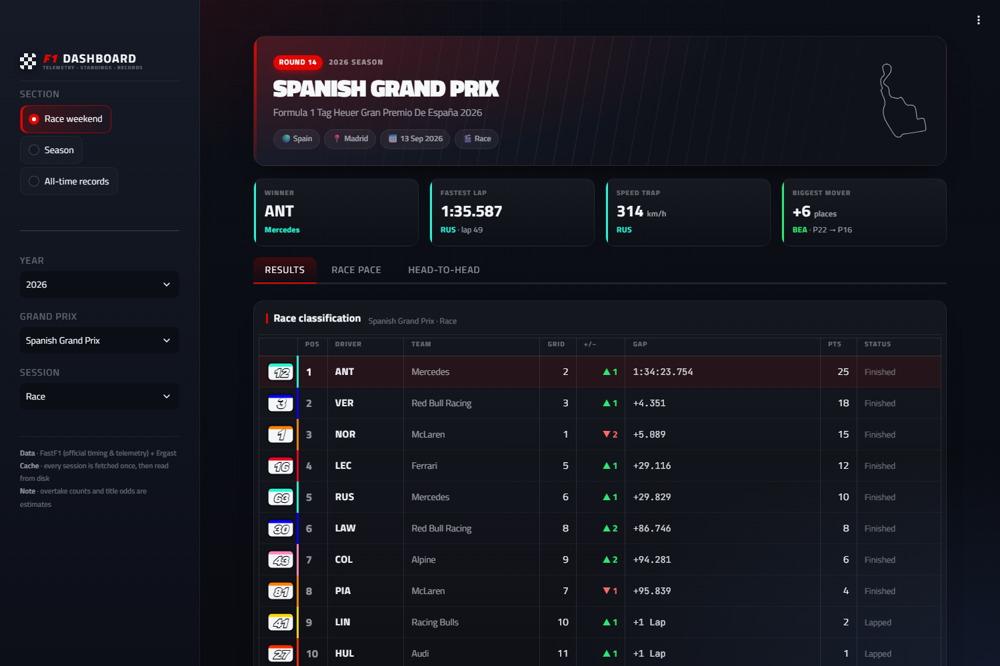
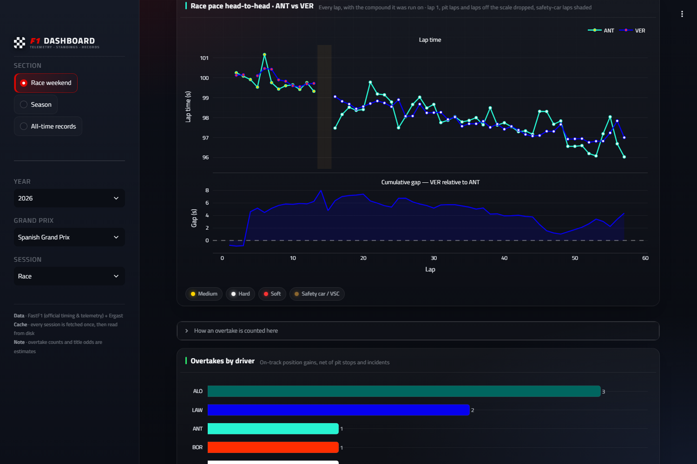
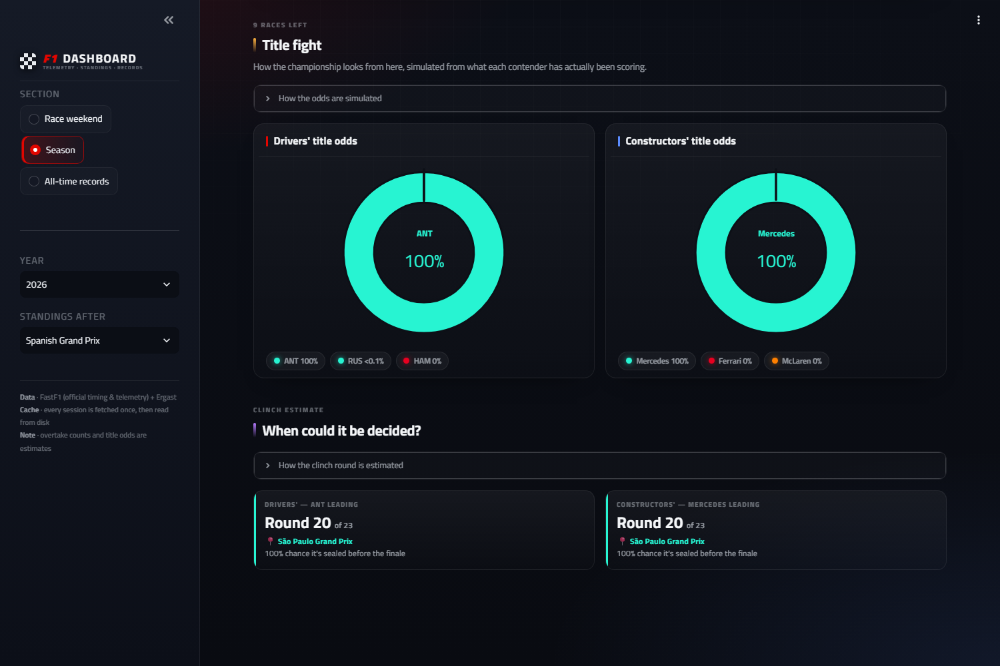

# F1 Analysis

Personal Formula 1 data analysis project, built on [FastF1](https://docs.fastf1.dev/) (official
timing and telemetry data): a Streamlit dashboard for a race weekend, a season and the sport's
all-time records, plus the standalone tyre-degradation script it grew out of.

**Live: [pitwall-pc.streamlit.app](https://pitwall-pc.streamlit.app/)** — or run it locally, where a
session is fetched from the F1 API the first time it's opened and read from disk after that.
There is no account and no database either way.

> Unofficial personal project. Not affiliated with, endorsed by, or connected to Formula 1,
> the FIA or any team; F1 and Formula 1 are trademarks of their respective owners. The data
> comes from public APIs through FastF1 and Ergast, and none of it is redistributed here.



Two drivers' race pace lap by lap, the marker carrying the compound each lap was run on, with
the cumulative gap between them underneath:



And the season view — standings, points progression, title odds:



## Setup

```
python -m venv venv
venv\Scripts\pip install -r requirements.txt
mkdir cache
```

## Hosted version

The official timing feed answers 403 to datacenter IPs — checked from Streamlit Community Cloud
and from GitHub Actions runners — so the hosted app can't download sessions the way a local run
does. Instead `publish_data.py` runs on a home PC (a daily Windows scheduled task): it loads every
finished session through FastF1 and uploads that session's cache folder, zipped, to a private
data repo. The hosted app, given a read-only token for that repo in its Streamlit secrets
(`F1_DATA_TOKEN`), downloads a session's files right before opening it, and FastF1 reads them
from disk without calling the feed. Only published sessions are listed there; a new race shows
up the day after it's run, as long as that PC is switched on at some point. Without the token —
any local run — none of this is used.

## Scripts

- `tyre_degradation.py` — lap time vs. tyre age per compound for a given race. Fits
  `LapTime ~ TyreLife + LapNumber` per compound (multiple linear regression) instead of a plain
  `LapTime ~ TyreLife` fit, since FastF1 doesn't expose fuel mass directly and `LapNumber` is
  used as its proxy (fuel burns off roughly linearly with laps completed) — without this, a long
  stint (typically Hard) shows lap times trending down for a reason that has nothing to do with
  the tyre. The `TyreLife` coefficient is the fuel-corrected degradation slope; on the first race
  tested it correctly orders Hard (~flat) < Medium < Soft (fastest degrading), matching real
  tyre physics. Also saves `tyre_degradation_by_driver.png`, the same idea broken down per
  driver per compound — who manages each tyre best. That breakdown fits only `TyreLife` per
  driver (not `TyreLife + LapNumber` again): a driver who ran a compound in a single stint has
  `TyreLife` and `LapNumber` climbing together 1-for-1, so the two-variable fit is collinear and
  the coefficients blow up (this produced nonsense ±20-30 s/lap bars at first). The fix is to
  take the fuel slope from the pooled, well-conditioned fit and subtract it out of each driver's
  lap times before fitting their tyre slope alone.
- `dashboard.py` — the Streamlit app. Three scopes, picked in the sidebar, because they answer
  questions at three different sizes: **Race weekend** (one session), **Season** (one
  championship) and **All-time records** (the sport).
  - *Race weekend* opens on a headline strip — winner, fastest lap, speed trap, biggest mover —
    over three tabs in the order a weekend is actually read: **Results** (classification with a
    places-gained column, plus every driver's position lap by lap with the podium band shaded),
    **Race pace** (tyre strategy, a two-driver head-to-head of every lap time with the
    compound on the marker and the
    cumulative gap under it, overtakes, race-pace spread as a box per driver, and fuel-corrected
    tyre degradation; in a qualifying session this tab is **Stats** instead: gap to pole, time
    lost against each driver's ideal lap, and the season's poles) and **Head-to-head** (the
    mini-sector track dominance map,
    the official sector splits as a diverging gap chart, and a five-panel lap trace — speed,
    delta, throttle, brake, gear — with x-linked axes, so zooming one panel zooms all five).
    The session dropdown is built from that weekend's real `Session1..5` names in the FastF1
    schedule, so Sprint Qualifying/Sprint show up only on sprint weekends. Delta time is computed
    by interpolating the other lap's elapsed time onto the reference lap's distance grid with
    `numpy.interp`, rather than `fastf1.utils.delta_time`, which the library's own docs flag as
    deprecated and not very accurate.
  - *Season* has **Championship** (both standings tables, points progression with the leader's
    line filled, Monte-Carlo title odds as donuts, and a clinch-round estimate) and **Race by
    race** (season records, a points-per-race heatmap of every scoring driver against every
    round, and overtakes by race and by driver).
  - *All-time records* ranks wins, poles, constructor wins, single-season wins, winning streaks
    and pole-to-win conversion across every championship race since 1950.

  Data is fetched from the F1 API on first request for a given year/event/session and cached
  locally after that (`cache/`) — there's no bulk pre-download of every past race, new races just
  show up in the dropdown once they've happened and get fetched the first time someone picks
  them. Run with `venv\Scripts\streamlit run dashboard.py`.


## Look and feel

The app carries its own dark theme rather than Streamlit's default: one stylesheet at the top of
`dashboard.py` (design tokens in `:root`, mirrored into the `PALETTE` dict, because Plotly draws
its figures from Python and never sees the page's CSS), plus `.streamlit/config.toml` for the
widgets Streamlit draws itself. Every chart sits in a card with its own header, so no figure
carries an in-plot title, and the long methodology notes — how an overtake is counted, what the
title-odds simulation actually does — live in collapsed expanders instead of as paragraphs of
body copy above the chart they explain. Typography is Titillium Web (the closest freely-licensed
stand-in for Formula 1's own proprietary face) with JetBrains Mono for every lap time and gap.

Two things to know before editing that stylesheet:

- Streamlit's DOM isn't ours, so selectors use `data-testid` and ARIA attributes only. The
  `st-emotion-cache-*` class names are content hashes that change on every Streamlit build, and
  `data-baseweb` doesn't exist on the tabs any more (1.63 builds them on react-aria). Nothing is
  hidden except the Deploy button and the status widget, so a rule that stops matching costs a
  bit of styling, never a control.
- The app-wide font rule has to exempt `[data-testid="stIconMaterial"]`. Streamlit draws its
  chevrons and arrows as ligatures in a Material Symbols font, and overriding that font renders
  every icon as its own name spelled out ("keyboard_arrow_right").
